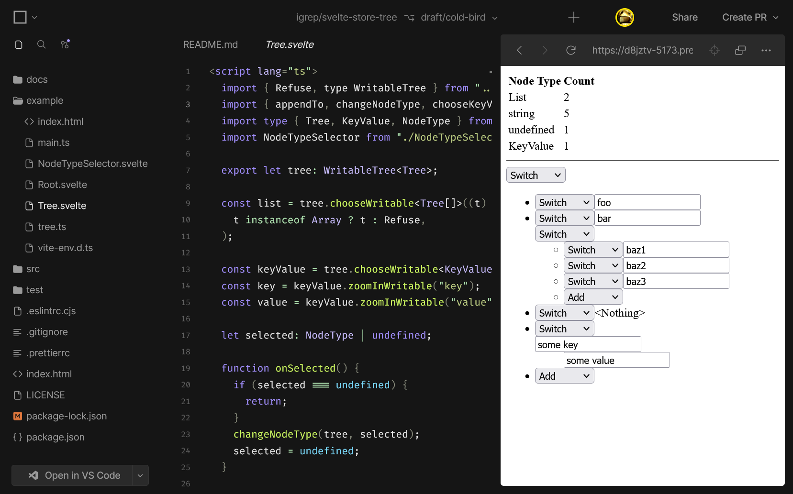

# svelte-store-tree

[](https://badge.fury.io/js/svelte-store-tree)
[](https://opensource.org/licenses/BSD-3-Clause)


Current status: Experimental.

Provides writable/readable stores that can 'zoom' into a part of the store
value (so-called "nested stores"). It enables us to manage the state of the app
in a single object while keeping the independence of every child component.

# Example

<!-- BEGIN README TEST -->

```typescript
import { writableTree, Refuse, into, choose, isPresent } from 'svelte-store-tree';
import type { WritableTree } from 'svelte-store-tree';

type SomeRecord = {
  id: number;
  name: string;
  contact: {
    phone: string;
    urls: string[];
  };
  favoriteColor: Color | undefined;
};

type Color = [number, number, number];

// Create a `WritableTree`
const someRecord: WritableTree<SomeRecord> = writableTree({
  id: 0,
  name: 'Y. Y',
  contact: {
    phone: '+81-00-0000-0000',
    urls: [
      'https://the.igreque.info',
      'https://github.com/igrep',
    ],
  },
  favoriteColor: undefined
});

// Subscribe as an ordinary store.
someRecord.subscribe((newUser) => {
  console.log('Updated the user', newUser);
});

// `zoom` with the `into` Accessor;
//    Create a store that subscribes only a specific field of the object
const name = someRecord.zoom(into('name'));
const contact = someRecord.zoom(into('contact'));
const favoriteColor = someRecord.zoom(into('favoriteColor'));

name.subscribe((newName) => {
  console.log('Updated the name', newName);
});
contact.subscribe((newContact) => {
  console.log('Updated the contact', newContact);
});
favoriteColor.subscribe((newColor) => {
  console.log('Updated the color', newColor);
});

// We can apply `zoom` deeper:
const urls = contact.zoom(into('urls'));

// Notifies the subscribers of `someRecord`, `contact`, and `urls`.
// ** Changes are propagated only to the direct subscribers, and the ancestors'. **
// ** Not to the the siblings' to avoid extra rerendering of the subscribing components. **
urls.update((u) => [...u, 'https://twitter.com/igrep']);

// If your record contains a union type, the `choose` Accessor is useful.
// Pass a function that returns a `Refuse` (a unique symbol provided by this library)
// if the value doesn't satisfy the condition.
const favoriteColorNonUndefined =
  favoriteColor.zoom(choose((color) => color ?? Refuse));

// Now, favoriteColorNonUndefined is typed as `WritableTree<Color>`,
// while favoriteColor is `WritableTree<Color | undefined>`.

// As a shortcut for a nullable type, svelte-store-tree provides
// the `isPresent` Accessor:
const favoriteColorNonUndefined2 = favoriteColor.zoom(isPresent());

favoriteColorNonUndefined.subscribe((newColor) => {
  console.log('Updated the color', newColor);
});

// Notifies the subscribers of `someRecord`, `favoriteColor`, and `favoriteColorNonUndefined`.
favoriteColor.set([0xC0, 0x10, 0x10]);

// Notifies the subscribers of `someRecord`, and `favoriteColor` (not `favoriteColorNonUndefined`).
favoriteColor.set(undefined);
```

<!-- END README TEST -->

# Working Example App

<a href="https://codesandbox.io/p/github/igrep/svelte-store-tree/draft/floral-sound?workspace=%257B%2522activeFileId%2522%253Anull%252C%2522openFiles%2522%253A%255B%255D%252C%2522sidebarPanel%2522%253A%2522EXPLORER%2522%252C%2522gitSidebarPanel%2522%253A%2522COMMIT%2522%252C%2522sidekickItems%2522%253A%255B%257B%2522type%2522%253A%2522PREVIEW%2522%252C%2522taskId%2522%253A%2522dev%2522%252C%2522port%2522%253A5173%252C%2522key%2522%253A%2522cl84b20px00942a69505zsdx2%2522%252C%2522isMinimized%2522%253Afalse%252C%2522path%2522%253A%2522%252Fexample%252F%2522%257D%252C%257B%2522type%2522%253A%2522TASK_LOG%2522%252C%2522taskId%2522%253A%2522dev%2522%252C%2522key%2522%253A%2522cl84b1zcx00452a69im60ktrw%2522%252C%2522isMinimized%2522%253Afalse%257D%255D%257D">
Run on CodeSandbox


</a>

# Installation

```bash
$ npm install --save svelte-store-tree
```

# API

```typescript
// Core API
export function writableTree<P>(
  value: P,
  start: StartStopNotifier<P> = noop,
): WritableTree<P>;

export function readableTree<P>(
  value: P,
  start: StartStopNotifier<P> = noop,
): ReadableTree<P>

/// Types related to the Core API
export type StoreTreeCore<P> = {
  zoom<C>(accessor: Accessor<P, C>): WritableTree<C>;
  zoomNoSet<C>(readChild: (parent: P) => C | Refuse): ReadableTree<C>;
};
export type ReadableTree<P> = Readable<P> & StoreTreeCore<P>;
export type WritableTree<P> = Writable<P> & StoreTreeCore<P>;

export const Refuse: unique symbol = Symbol();
export type Refuse = typeof Refuse;

// Accessor API
export class Accessor<P, C> {
  readChild: (parent: P) => C | Refuse;
  writeChild: (parent: P, newChild: C) => void;
  and<GC>(other: Accessor<C, GC>): Accessor<P, GC>;
};

/// Various Utility Accessors
export function into<P, K extends keyof P>(key: K): Accessor<P, P[K]>;
export function intoMap<K extends string | number | symbol, V>(key: K): Accessor<Map<K, V>, V>;
export function isPresent<P>(): Accessor<P, NonNullable<P>>;
export function choose<P, C>(readChild: (parent: P) => C | Refuse): Accessor<P, C>;

export type Key = string | number | symbol;
```
